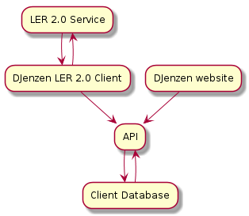

# Digital Ledningsregistrering - LER 2.0

## Service

Makes digital wire registration for smaller water facilities and similar in DK. Hosts this data and communicates with LER2.0

## Software Architecture
The architecture behind the project and service of the product

### Server service

[Documentation backend](./ler_2_server/backend_info.md)

[Documentation database](./ler_2_database/database_info.md)

#### Requirements

* MUST automatically interact with LER2.0
* Save data - MUST be backed up

### Client interface

#### Requirements

* Communicate what it does precise - MUST (Anna) 
* Automatic upload of analog documents - MAYBE
* MUST have easy upload of data 